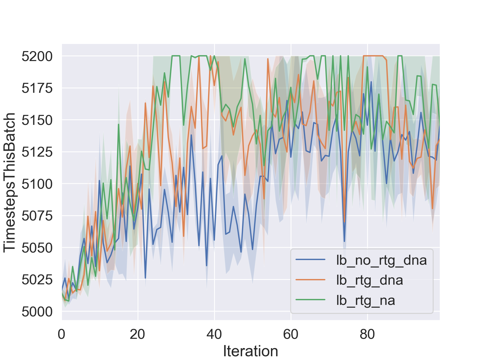
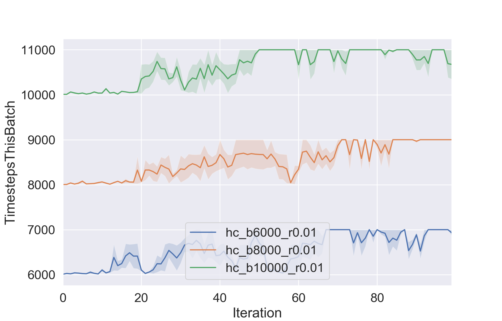
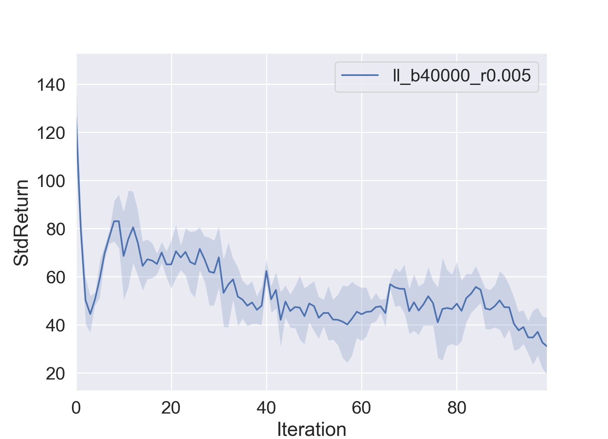
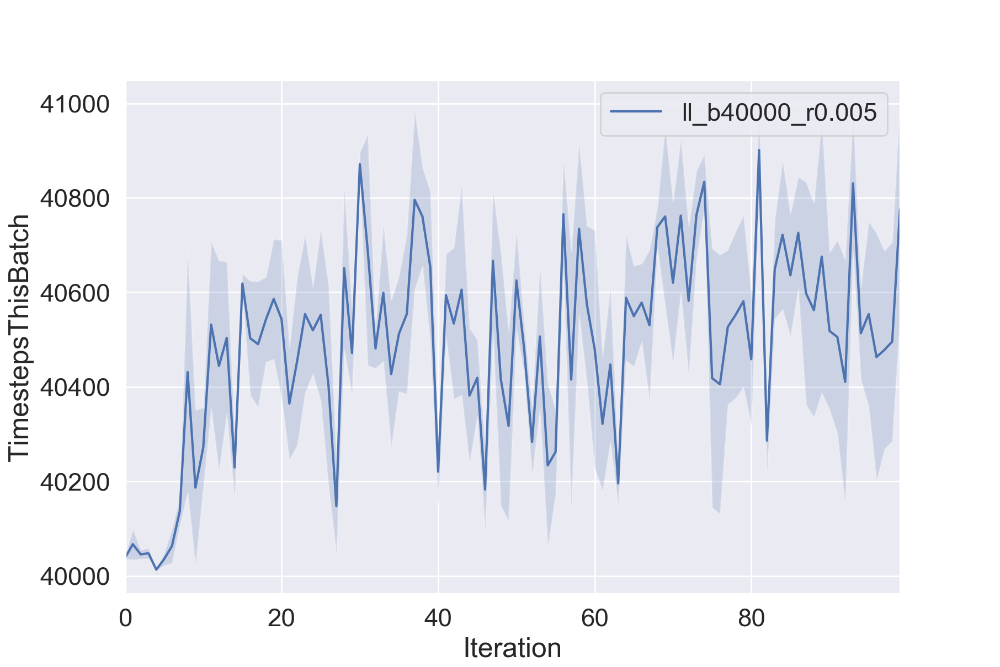
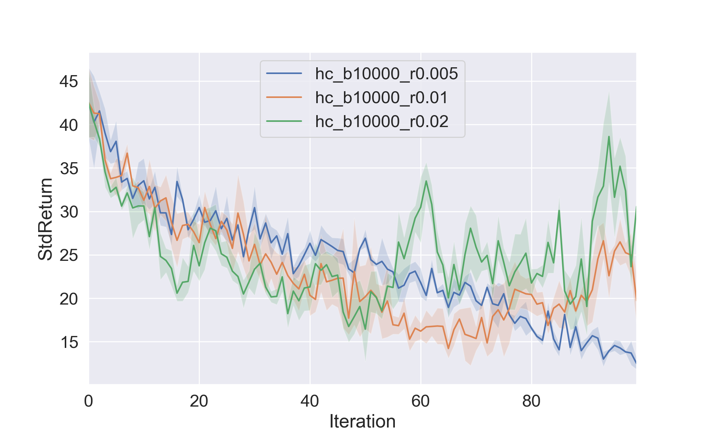
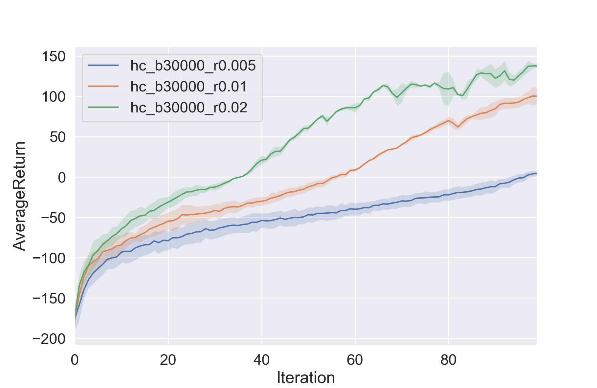
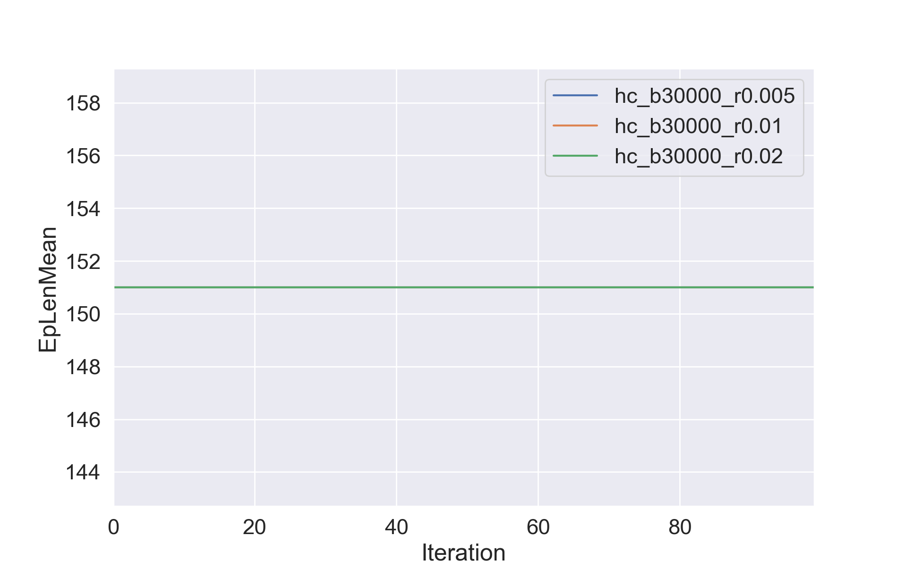
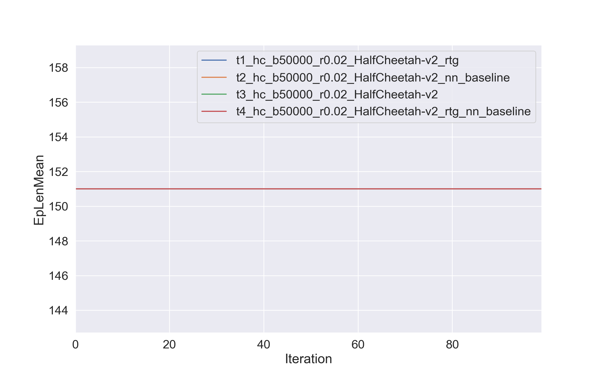

# CS294-112 HW 2: Policy Gradient

Dependencies:
 * Python **3.5**
 * Numpy version **1.14.5**
 * TensorFlow version **1.10.5**
 * MuJoCo version **1.50** and mujoco-py **1.50.1.56**
 * OpenAI Gym version **0.10.5**
 * seaborn
 * Box2D==**2.3.2**

Before doing anything, first replace `gym/envs/box2d/lunar_lander.py` with the provided `lunar_lander.py` file.

The only file that you need to look at is `train_pg_f18.py`, which you will implement.

See the [HW2 PDF](http://rail.eecs.berkeley.edu/deeprlcourse/static/homeworks/hw2.pdf) for further instructions.

## 2. Exercise
### 5.2 [Problem 4] CartPole - Discrete Action Space
```bash
python train_pg_f18.py CartPole-v0 -n 100 -b 1000 -e 3 -dna --exp_name sb_no_rtg_dna
python train_pg_f18.py CartPole-v0 -n 100 -b 1000 -e 3 -rtg -dna --exp_name sb_rtg_dna
python train_pg_f18.py CartPole-v0 -n 100 -b 1000 -e 3 -rtg --exp_name sb_rtg_na
python train_pg_f18.py CartPole-v0 -n 100 -b 5000 -e 3 -dna --exp_name lb_no_rtg_dna
python train_pg_f18.py CartPole-v0 -n 100 -b 5000 -e 3 -rtg -dna --exp_name lb_rtg_dna
python train_pg_f18.py CartPole-v0 -n 100 -b 5000 -e 3 -rtg --exp_name lb_rtg_na
```
Result:
OOM on 2*8G GPU environment

```bash
python train_pg_f18.py CartPole-v0 -n 100 -b 1000 -e 2 -dna --exp_name sb_no_rtg_dna
```
Result:
OOM on 2*8G GPU environment

1) on local mac with 2*8G GPU (in sequential mode)
* batch size = 1000
```bash
python train_pg_f18.py CartPole-v0 -n 100 -b 1000 -e 3 -dna --exp_name sb_no_rtg_dna [OK, not normalize advantages, for all rewards]
python train_pg_f18.py CartPole-v0 -n 100 -b 1000 -e 3 -rtg -dna --exp_name sb_rtg_dna [OK, not normalize advantages, rewards to go]
python train_pg_f18.py CartPole-v0 -n 100 -b 1000 -e 3 -rtg --exp_name sb_rtg_na [OK, normalize advantages, rewards to go]
```
Analysis for result
```bash
python plot.py --logdir data/sb_no_rtg_dna_CartPole-v0_05-11-2018_19-25-17/ data/sb_rtg_dna_CartPole-v0_05-11-2018_19-27-59/ data/sb_rtg_na_CartPole-v0_05-11-2018_19-38-55/ --legend sb_no_rtg_dna sb_rtg_dna sb_rtg_na --value AverageReturn StdReturn EpLenMean TimestepsThisBatch
```
1. Average Return Figure:  


2. Eposide Length Mean:  


3. Standard Deviation Return:  


4. Time Steps used is this batch:  


* batch size = 5000
```bash
python train_pg_f18.py CartPole-v0 -n 100 -b 5000 -e 3 -dna --exp_name lb_no_rtg_dna [OK, not normalize advantages, for all rewards]
python train_pg_f18.py CartPole-v0 -n 100 -b 5000 -e 3 -rtg -dna --exp_name lb_rtg_dna [OK, not normalize advantages, rewards to go]
python train_pg_f18.py CartPole-v0 -n 100 -b 5000 -e 3 -rtg --exp_name lb_rtg_na [OK, normalize advantages, rewards to go]
```
Analysis for result
```bash
python plot.py --logdir data/lb_no_rtg_dna_CartPole-v0_05-11-2018_19-52-26/ data/lb_rtg_dna_CartPole-v0_05-11-2018_20-05-54/ data/lb_rtg_na_CartPole-v0_05-11-2018_20-18-38/ --legend lb_no_rtg_dna lb_rtg_dna lb_rtg_na --value AverageReturn StdReturn EpLenMean TimestepsThisBatch
```
1. Average Return Figure:  


2. Eposide Length Mean:  


3. Standard Deviation Return:  


4. Time Steps used is this batch:  




### 5.3 [Problem 5] InvertedPendulum - **Continous Action Space**

```bash
python train_pg_f18.py InvertedPendulum-v2 -ep 1000 --discount 0.9 -n 100 -e 3 -l 2 -s 64 -b 6000 -lr 0.01 -rtg --exp_name hc_b6000_r0.01 [OK]
python train_pg_f18.py InvertedPendulum-v2 -ep 1000 --discount 0.9 -n 100 -e 3 -l 2 -s 64 -b 8000 -lr 0.01 -rtg --exp_name hc_b8000_r0.01 [OK]
python train_pg_f18.py InvertedPendulum-v2 -ep 1000 --discount 0.9 -n 100 -e 3 -l 2 -s 64 -b 10000 -lr 0.01 -rtg --exp_name hc_b10000_r0.01
```

Analysis for result
```bash
python plot.py --logdir data/hc_b6000_r0.01_InvertedPendulum-v2_05-11-2018_20-30-17/ data/hc_b8000_r0.01_InvertedPendulum-v2_05-11-2018_21-17-34/ data/hc_b10000_r0.01_InvertedPendulum-v2_05-11-2018_21-41-36/ --legend hc_b6000_r0.01 hc_b8000_r0.01 hc_b10000_r0.01 --value AverageReturn StdReturn EpLenMean TimestepsThisBatch
```

1. Average Return Figure:  


2. Eposide Length Mean:  


3. Standard Deviation Return:  


4. Time Steps used is this batch:  



### 7 More Complex Tasks

#### 1. [Problem 7] LunarLander - Discrete Action Space

```bash
pip install box2d-py # install to support after swig installed
python train_pg_f18.py LunarLanderContinuous-v2 -ep 1000 --discount 0.99 -n 100 -e 3 -l 2 -s 64 -b 40000 -lr 0.005 -rtg --nn_baseline --exp_name ll_b40000_r0.005
```

Result analysis:
```bash
python plot.py --logdir data/ll_b40000_r0.005_LunarLanderContinuous-v2_05-11-2018_22-21-46 --legend ll_b40000_r0.005 --value AverageReturn StdReturn EpLenMean TimestepsThisBatch
```

1. Average Return Figure:  


2. Eposide Length Mean:  


3. Standard Deviation Return:  



4. Time Steps used is this batch:  



#### 2. [Problem 8] HalfCheetah - Discrete Action Space

```bash
bash HalfCheetah.sh
```

* for batch=10000, lrs=(0.005 0.01 0.02)
Result analysis:
```bash
python plot.py --logdir data/hc_b10000_r0.005_HalfCheetah-v2_05-11-2018_23-06-28 data/hc_b10000_r0.01_HalfCheetah-v2_05-11-2018_23-41-32 data/hc_b10000_r0.02_HalfCheetah-v2_06-11-2018_00-15-45 --legend hc_b10000_r0.005 hc_b10000_r0.01 hc_b10000_r0.02 --value AverageReturn StdReturn EpLenMean TimestepsThisBatch
```

1. Average Return Figure:  


2. Eposide Length Mean:  


3. Standard Deviation Return:  



4. Time Steps used is this batch:  


* for batch=30000, lrs=(0.005 0.01 0.02)
Result analysis:
```bash
python plot.py --logdir data/hc_b30000_r0.005_HalfCheetah-v2_06-11-2018_00-50-14 data/hc_b30000_r0.01_HalfCheetah-v2_06-11-2018_02-32-01 data/hc_b30000_r0.02_HalfCheetah-v2_06-11-2018_04-13-33 --legend hc_b30000_r0.005 hc_b30000_r0.01 hc_b30000_r0.02 --value AverageReturn StdReturn EpLenMean TimestepsThisBatch
```
1. Average Return Figure:  



2. Eposide Length Mean:  



3. Standard Deviation Return:  


4. Time Steps used is this batch:  


* for batch=50000, lrs=(0.005 0.01 0.02)
Result analysis:
```bash
python plot.py --logdir data/hc_b50000_r0.005_HalfCheetah-v2_06-11-2018_05-50-55 data/hc_b50000_r0.01_HalfCheetah-v2_06-11-2018_10-18-09 data/hc_b50000_r0.02_HalfCheetah-v2_06-11-2018_12-29-48 --legend hc_b50000_r0.005 hc_b50000_r0.01 hc_b50000_r0.02 --value AverageReturn StdReturn EpLenMean TimestepsThisBatch
```

1. Average Return Figure:  


2. Eposide Length Mean:  


3. Standard Deviation Return:  


4. Time Steps used is this batch:  


Conclusion: obviously batch size=50000, learning rate=0.02 help RL algorithm start to converge

* For batch=50000, learning rate=0.02

##### trial 1
```bash
python train_pg_f18.py HalfCheetah-v2 -ep 150 --discount 0.95 -n 100 -e 3 -l 2 -s 32 -b 50000 -lr 0.02 --exp_name t1_hc_b50000_r0.02
```
output folder: data/t1_hc_b50000_r0.02_HalfCheetah-v2_06-11-2018_14-25-58

##### trial 2
```bash
python train_pg_f18.py HalfCheetah-v2 -ep 150 --discount 0.95 -n 100 -e 3 -l 2 -s 32 -b 50000 -lr 0.02 -rtg --exp_name t2_hc_b50000_r0.02
```
output folder: data/t2_hc_b50000_r0.02_HalfCheetah-v2_06-11-2018_22-20-14

##### trial 3
```bash
python train_pg_f18.py HalfCheetah-v2 -ep 150 --discount 0.95 -n 100 -e 3 -l 2 -s 32 -b 50000 -lr 0.02 --nn_baseline --exp_name t3_hc_b50000_r0.02
```
output folder: data/t3_hc_b50000_r0.02_HalfCheetah-v2_07-11-2018_01-02-25

##### trial 4
```bash
python train_pg_f18.py HalfCheetah-v2 -ep 150 --discount 0.95 -n 100 -e 3 -l 2 -s 32 -b 50000 -lr 0.02 -rtg --nn_baseline --exp_name t4_hc_b50000_r0.02
```
output folder: data/t4_hc_b50000_r0.02_HalfCheetah-v2_07-11-2018_03-38-25

```bash
python plot.py --logdir data/t1_hc_b50000_r0.02_HalfCheetah-v2_06-11-2018_14-25-58 data/t2_hc_b50000_r0.02_HalfCheetah-v2_06-11-2018_22-20-14 data/t3_hc_b50000_r0.02_HalfCheetah-v2_07-11-2018_01-02-25  data/t4_hc_b50000_r0.02_HalfCheetah-v2_07-11-2018_03-38-25 --legend t1_hc_b50000_r0.02_HalfCheetah-v2_rtg t2_hc_b50000_r0.02_HalfCheetah-v2_nn_baseline t3_hc_b50000_r0.02_HalfCheetah-v2 t4_hc_b50000_r0.02_HalfCheetah-v2_rtg_nn_baseline --value AverageReturn StdReturn EpLenMean TimestepsThisBatch
```
1. Average Return Figure:  


2. Eposide Length Mean:  



3. Standard Deviation Return:  


4. Time Steps used is this batch:  


### 8 Bonus
a) threading parallelization

b) GAE-$\lambda$

c) PG's multiple gradient descent steps