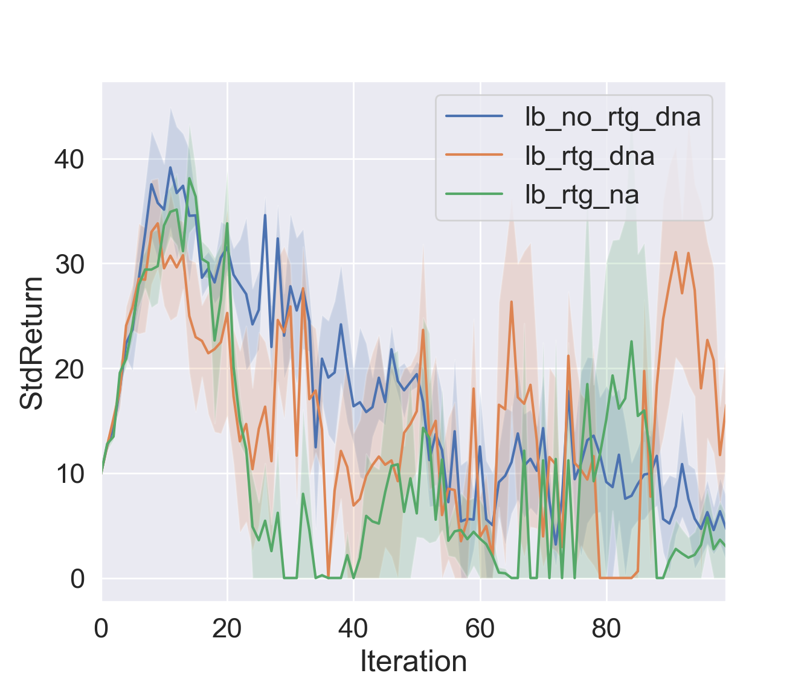

# CS294-112 HW 2: Policy Gradient

Dependencies:
 * Python **3.5**
 * Numpy version **1.14.5**
 * TensorFlow version **1.10.5**
 * MuJoCo version **1.50** and mujoco-py **1.50.1.56**
 * OpenAI Gym version **0.10.5**
 * seaborn
 * Box2D==**2.3.2**

Before doing anything, first replace `gym/envs/box2d/lunar_lander.py` with the provided `lunar_lander.py` file.

The only file that you need to look at is `train_pg_f18.py`, which you will implement.

See the [HW2 PDF](http://rail.eecs.berkeley.edu/deeprlcourse/static/homeworks/hw2.pdf) for further instructions.

## 2. Exercise
### 5.2 [Problem 4] CartPole
```bash
python train_pg_f18.py CartPole-v0 -n 100 -b 1000 -e 3 -dna --exp_name sb_no_rtg_dna
python train_pg_f18.py CartPole-v0 -n 100 -b 1000 -e 3 -rtg -dna --exp_name sb_rtg_dna
python train_pg_f18.py CartPole-v0 -n 100 -b 1000 -e 3 -rtg --exp_name sb_rtg_na
python train_pg_f18.py CartPole-v0 -n 100 -b 5000 -e 3 -dna --exp_name lb_no_rtg_dna
python train_pg_f18.py CartPole-v0 -n 100 -b 5000 -e 3 -rtg -dna --exp_name lb_rtg_dna
python train_pg_f18.py CartPole-v0 -n 100 -b 5000 -e 3 -rtg --exp_name lb_rtg_na
```
Result:
OOM on 2*8G GPU environment

```bash
python train_pg_f18.py CartPole-v0 -n 100 -b 1000 -e 2 -dna --exp_name sb_no_rtg_dna
```
Result:
OOM on 2*8G GPU environment

1) on local mac with 2*8G GPU (in sequential mode)
* batch size = 1000
```bash
python train_pg_f18.py CartPole-v0 -n 100 -b 1000 -e 3 -dna --exp_name sb_no_rtg_dna [OK, not normalize advantages, for all rewards]
python train_pg_f18.py CartPole-v0 -n 100 -b 1000 -e 3 -rtg -dna --exp_name sb_rtg_dna [OK, not normalize advantages, rewards to go]
python train_pg_f18.py CartPole-v0 -n 100 -b 1000 -e 3 -rtg --exp_name sb_rtg_na [OK, normalize advantages, rewards to go]
```
Analysis for result
```bash
python plot.py --logdir data/sb_no_rtg_dna_CartPole-v0_03-11-2018_18-05-40/ data/sb_rtg_dna_CartPole-v0_04-11-2018_10-57-28/ data/sb_rtg_na_CartPole-v0_04-11-2018_20-17-05/ --legend sb_no_rtg_dna sb_rtg_dna sb_rtg_na --value AverageReturn StdReturn EpLenMean TimestepsThisBatch
```
1. Average Return Figure:  


2. Eposide Length Mean:  


3. Standard Deviation Return:  


4. Time Steps used is this batch:  


* batch size = 5000
```bash
python train_pg_f18.py CartPole-v0 -n 100 -b 5000 -e 3 -dna --exp_name lb_no_rtg_dna [OK, not normalize advantages, for all rewards]
python train_pg_f18.py CartPole-v0 -n 100 -b 5000 -e 3 -rtg -dna --exp_name lb_rtg_dna [OK, not normalize advantages, rewards to go]
python train_pg_f18.py CartPole-v0 -n 100 -b 5000 -e 3 -rtg --exp_name lb_rtg_na [OK, normalize advantages, rewards to go]
```
Analysis for result
```bash
python plot.py --logdir data/lb_no_rtg_dna_CartPole-v0_04-11-2018_20-20-15/ data/lb_rtg_dna_CartPole-v0_04-11-2018_20-32-22/ data/lb_rtg_na_CartPole-v0_04-11-2018_20-48-24 --legend lb_no_rtg_dna lb_rtg_dna lb_rtg_na --value AverageReturn StdReturn EpLenMean TimestepsThisBatch
```
1. Average Return Figure:  


2. Eposide Length Mean:  


3. Standard Deviation Return:  



4. Time Steps used is this batch:  


### 5.3 [Problem 5] InvertedPendulum
