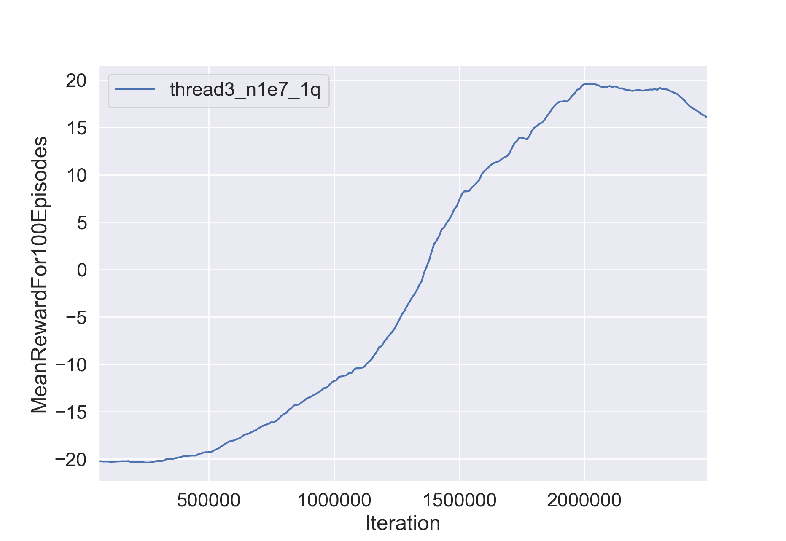
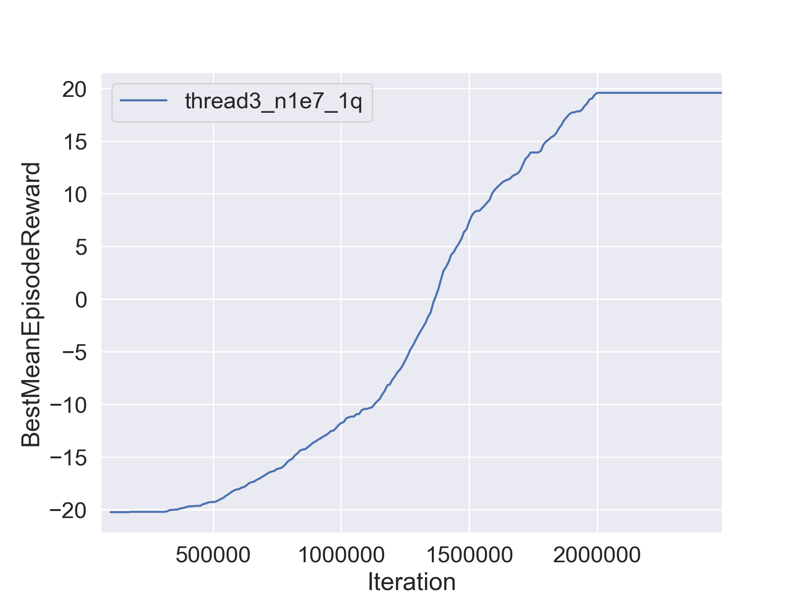

# CS294-112 HW 3: Q-Learning

Dependencies:
 * Python **3.6**
 * Numpy version **1.14.5**
 * TensorFlow version **1.10.5**
 * MuJoCo version **1.50** and mujoco-py **1.50.1.56**
 * OpenAI Gym version **0.10.8**
 * seaborn
 * Box2D==**2.3.2**
 * OpenCV
 * ffmpeg

Before doing anything, first replace `gym/envs/box2d/lunar_lander.py` with the provided `lunar_lander.py` file.

The only files that you need to look at are `dqn.py` and `train_ac_f18.py`, which you will implement.

See the [HW3 PDF](http://rail.eecs.berkeley.edu/deeprlcourse/static/homeworks/hw3.pdf) for further instructions.

The starter code was based on an implementation of Q-learning for Atari generously provided by Szymon Sidor from OpenAI.

## 1. Installation
* For mac preparation
    ```bash
    brew install ffmpeg # [DON't Install This on macOS, as it don't have libx264 enabled]
    conda install opencv-python
    conda install gym[atari]
    ```
* install PyOpenGL-3.0.1 on local
    ```bash
    wget https://nchc.dl.sourceforge.net/project/pyopengl/PyOpenGL/3.0.1/PyOpenGL-3.0.1.zip
    unzip PyOpenGL-3.0.1.zip
    cd PyOpenGL-3.0.1
    python setup.py build
    python setup.py install
    ```
* Issue: encoding problem [Unknown encoder 'libx264'], on ubuntu solution https://stackoverflow.com/questions/9764740/unknown-encoder-libx264
  This building of ffmpeg on conda, customized with libx264
    ```bash
    conda install -c conda-forge ffmpeg
    ```

* For windows version of gym[atari], refer to https://stackoverflow.com/questions/42605769/openai-gym-atari-on-windows

    1. atari-py installation for windows
    ```bash
    pip install --no-index -f https://github.com/Kojoley/atari-py/releases atari_py
    # If you have any distutils supported compiler you can install from sources:
    pip install git+https://github.com/Kojoley/atari-py.git
    ```
    2. ffmpeg installation for windows
    ```bash
    conda install -c conda-forge ffmpeg
    ```
    3. swig installation for windows (box2d dependency)
    ```bash
    conda install swig
    ```

* For Ubuntu version
    1. installation for ffmpeg
    ```bash
    sudo apt-get install ffmpeg
    ```
    2. installation for libx264
    ```bash
    sudo apt-get install libav-tools
    ```
## 2. Exercise

### 2.1 Q-Learning
#### 2.1.1 Correctness Verification
As described in homework 3, using Atari, RAM and Lander to check if Q-learning is somehow running on the same reward level.
* Atari
1. run 2e8 steps
```bash
python run_dqn_atari.py
```
2. result
```bash
# 500k steps : -19.5
Timestep 500000
mean reward (100 episodes) -19.500000
best mean reward -19.500000
episodes 510
exploration 0.550000
learning_rate 0.000100
running time 0.822805
# 1m steps : -13.27
Timestep 1000000
mean reward (100 episodes) -13.270000
best mean reward -13.270000
episodes 743
exploration 0.100000
learning_rate 0.000100
running time 0.954810
# 1.5m steps : 7.43
Timestep 1500000
mean reward (100 episodes) 7.430000
best mean reward 7.430000
episodes 902
exploration 0.098125
learning_rate 0.000100
running time 0.959555
# 2m steps: 14.7
Timestep 2000000
mean reward (100 episodes) 14.780000
best mean reward 15.170000
episodes 1102
exploration 0.096250
learning_rate 0.000100
running time 0.999033
# 3.1m steps: 16.52
Timestep 3120000
mean reward (100 episodes) 16.520000
best mean reward 16.850000
episodes 1558
exploration 0.092050
learning_rate 0.000100
running time 0.968937
### still increase for reward to 4m/5m
Timestep 3160000
mean reward (100 episodes) 16.830000
best mean reward 16.890000
episodes 1578
exploration 0.091900
learning_rate 0.000100
running time 0.957416
```
* RAM
1. run 4e7 steps
```bash
python run_dqn_ram.py
```
2. result
```bash
# 500k steps : -18.52
Timestep 500000
mean reward (100 episodes) -18.520000
best mean reward -18.050000
episodes 1452
exploration 0.150000
learning_rate 0.000100
running time 0.484703
# 1m steps : -17.24
Timestep 1000000
mean reward (100 episodes) -17.240000
best mean reward -16.720000
episodes 2472
exploration 0.100000
learning_rate 0.000100
running time 0.490712
# 1.5m steps : -16.84
Timestep 1500000
mean reward (100 episodes) -16.840000
best mean reward -16.310000
episodes 3304
exploration 0.088750
learning_rate 0.000094
running time 0.486633
# 2m steps : -16.52
Timestep 2000000
mean reward (100 episodes) -16.520000
best mean reward -15.750000
episodes 4061
exploration 0.077500
learning_rate 0.000087
running time 0.486097
# 4m steps : -15.15
Timestep 4040000
mean reward (100 episodes) -15.150000
best mean reward -14.690000
episodes 6995
exploration 0.031600
learning_rate 0.000062
running time 0.491079
```
* RAM
1. run 500000 steps
```bash
python run_dqn_lander.py
```
2. result
```bash
# 400k steps : 36.02
Timestep 400000
mean reward (100 episodes) 36.026020
best mean reward 259.236505
episodes 1050
exploration 0.020000
learning_rate 0.001000
running time 0.303040
# 5m steps: -554
Timestep 500000
mean reward (100 episodes) -554.889401
best mean reward 259.236505
episodes 1742
exploration 0.020000
learning_rate 0.001000
running time 0.255324
```
#### 2.1.2 Evaluation
* Question 1: logging and plot for atari
```bash
python run_dqn_atari.py -t 3 -n 10000000 --enable_double_q false
```
Parameter setting:
 1. tensorflow internal thread num = 3   
 2. n = 10000000   
Result folder: data/atari_PongNoFrameskip-v4_11-11-2018_13-20-23

Analysis for result   
```bash
python plot.py data/atari_PongNoFrameskip-v4_11-11-2018_13-20-23 --legend thread3_n1e7_1q --value MeanRewardFor100Episodes BestMeanEpisodeReward
```
1. MeanRewardFor100Episodes Figure:  



2. BestMeanEpisodeReward Mean:   



Conclusion:  
* rewards to 1200 episodes (timesteps=2490000) is about 15-20

* Question 2: duoble Q-learning
```bash
python run_dqn_atari.py -t 3 -n 10000000
```
Parameter setting:
 1. tensorflow internal thread num = 3   
 2. n = 10000000  
 3. double Q network
Result folder: data/atari_PongNoFrameskip-v4_11-11-2018_21-34-41
Analysis for result   
```bash
python plot.py data/atari_PongNoFrameskip-v4_11-11-2018_21-34-41 --legend thread3_n1e7_double_q --value MeanRewardFor100Episodes BestMeanEpisodeReward
```
1. MeanRewardFor100Episodes Figure:  


2. BestMeanEpisodeReward Mean:   


Conclusion:
* double-Q iterate more stably, but increase slowly compared with vanilla DQN
* after peek of 200000, vanilla DQN begin to drop down, but double-DQN keep constantly increasing (seems not to reach convergence)

* Question 3: Experimenting with hyperparameters

##### Experiment on local macOS
Q-3.1. benchmark for basic setting [the same as  Question 2]
```bash
python run_dqn_atari.py -t 3 -n 10000000
```
Parameter setting:
 1. tensorflow internal thread num = 3   
 2. n = 10000000  
 3. double Q network


Q-3.2. improvement for benchmark [compared with Question 2]
* Case 1: with accerlated learning rate   

```bash
python run_dqn_atari.py -t 3 -n 10000000 -l 1e-3 5e-4 1e-4
```

* Case 2: with accerlated learning rate and multilayer of Q(state, action) network

```bash
python run_dqn_atari.py -t 3 -n 10000000 -l 1e-3 5e-4 1e-4 -nn 512 256 128
```

##### Experiment on cnpvgl903653
Q-3.2. benchmark for basic setting on cnpvgl903653
```bash
python run_dqn_atari.py -t 3 -n 10000000
```
Parameter setting:
 1. tensorflow internal thread num = 3   
 2. n = 10000000  
 3. double Q network
output folder: data/atari_PongNoFrameskip-v4_12-11-2018_13-27-29


Q-3.2. improvement for benchmark [compared with Question 2]
* Case 1: with accerlated learning rate   

```bash
python run_dqn_atari.py -t 3 -n 10000000 -l 1e-3 5e-4 1e-4
```

* Case 2: with accerlated learning rate and multilayer of Q(state, action) network

```bash
python run_dqn_atari.py -t 3 -n 10000000 -l 1e-3 5e-4 1e-4 -nn 512 256 128
```


### 2.2 Actor-Critic Implementation
#### 2.2.1 Correctness Verification
##### Question 1: Sanity check with Cartpole
```bash
python train_ac_f18.py CartPole-v0 -n 100 -b 1000 -e 3 --exp_name 1_1 -ntu 1 -ngsptu 1
```
output folder: data/ac_1_1_CartPole-v0_12-11-2018_21-31-34
Analysis of result   
```bash
python plot.py data/ac_1_1_CartPole-v0_12-11-2018_21-31-34 --legend CartPolev0_n100_b1000_e3_exp_name1_1_ntu1_ngsptu1 --value AverageReturn StdReturn EpLenMean
```
1. AverageReturn Figure:  


2. StdReturn Figure:   


3. EpLenMean Figure:   


#### 2.2.2 Evaluate result

1) Trial 1
```bash
python train_ac_f18.py CartPole-v0 -n 100 -b 1000 -e 3 --exp_name 100_1 -ntu 100 -ngsptu 1
```
output folder: data/ac_100_1_CartPole-v0_12-11-2018_21-37-25
Analysis of result   
```bash
python plot.py data/ac_100_1_CartPole-v0_12-11-2018_21-37-25 --legend CartPolev0_n100_b1000_e3_exp_name100_1_ntu100_ngsptu1 --value AverageReturn StdReturn EpLenMean
```
1. AverageReturn Figure:  


2. StdReturn Figure:   


3. EpLenMean Figure:   


2) Trial 2
```bash
python train_ac_f18.py CartPole-v0 -n 100 -b 1000 -e 3 --exp_name 1_100 -ntu 1 -ngsptu 100
```
output folder: data/ac_1_100_CartPole-v0_12-11-2018_21-45-19
Analysis of result   
```bash
python plot.py data/ac_1_100_CartPole-v0_12-11-2018_21-45-19 --legend CartPolev0_n100_b1000_e3_exp_name1_100_ntu1_ngsptu100 --value AverageReturn StdReturn EpLenMean
```
1. AverageReturn Figure:  


2. StdReturn Figure:   


3. EpLenMean Figure:   


3) Trial 3
```bash
python train_ac_f18.py CartPole-v0 -n 100 -b 1000 -e 3 --exp_name 10_10 -ntu 10 -ngsptu 10
```
output folder: data/ac_10_10_CartPole-v0_12-11-2018_21-51-09
Analysis of result   
```bash
python plot.py data/ac_10_10_CartPole-v0_12-11-2018_21-51-09 --legend CartPolev0_n100_b1000_e3_exp_name10_10_ntu10_ngsptu10 --value AverageReturn StdReturn EpLenMean
```
1. AverageReturn Figure:  


2. StdReturn Figure:   


3. EpLenMean Figure:   


##### Question 2: Run actor-critic with more difficult tasks
* InvertedPendulum-v2
```bash
python train_ac_f18.py InvertedPendulum-v2 -ep 1000 --discount 0.95 -n 100 -e 3 -l 2 -s 64 -b 5000 -lr 0.01 --exp_name 100_100 -ntu 100 -ngsptu 100
```
output folder: data/
Analysis of result   


* HalfCheetah-v2
```bash
python train_ac_f18.py HalfCheetah-v2 -ep 150 --discount 0.90 -n 100 -e 3 -l 2 -s 32 -b 30000 -lr 0.02 --exp_name <>_<> -ntu <> -ngsptu <>
```
output folder: data/
Analysis of result   
