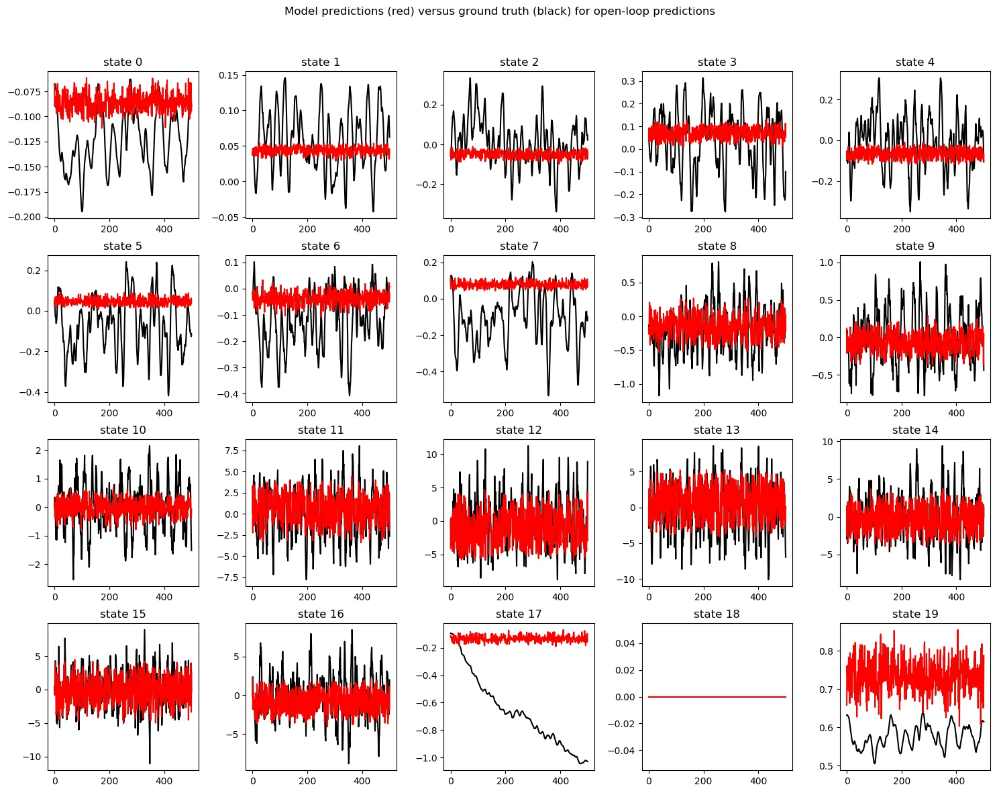
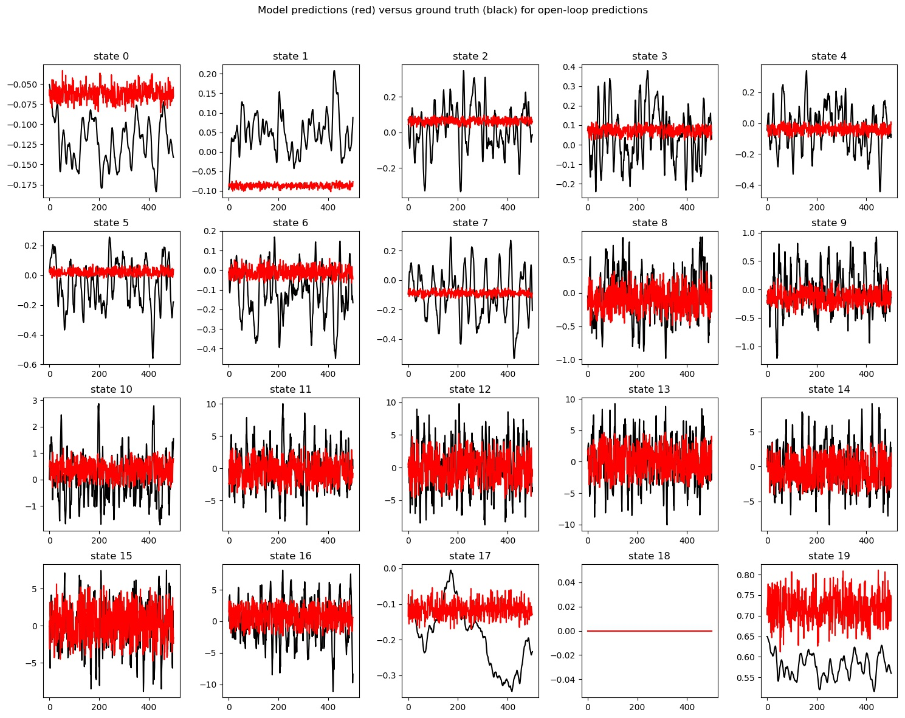
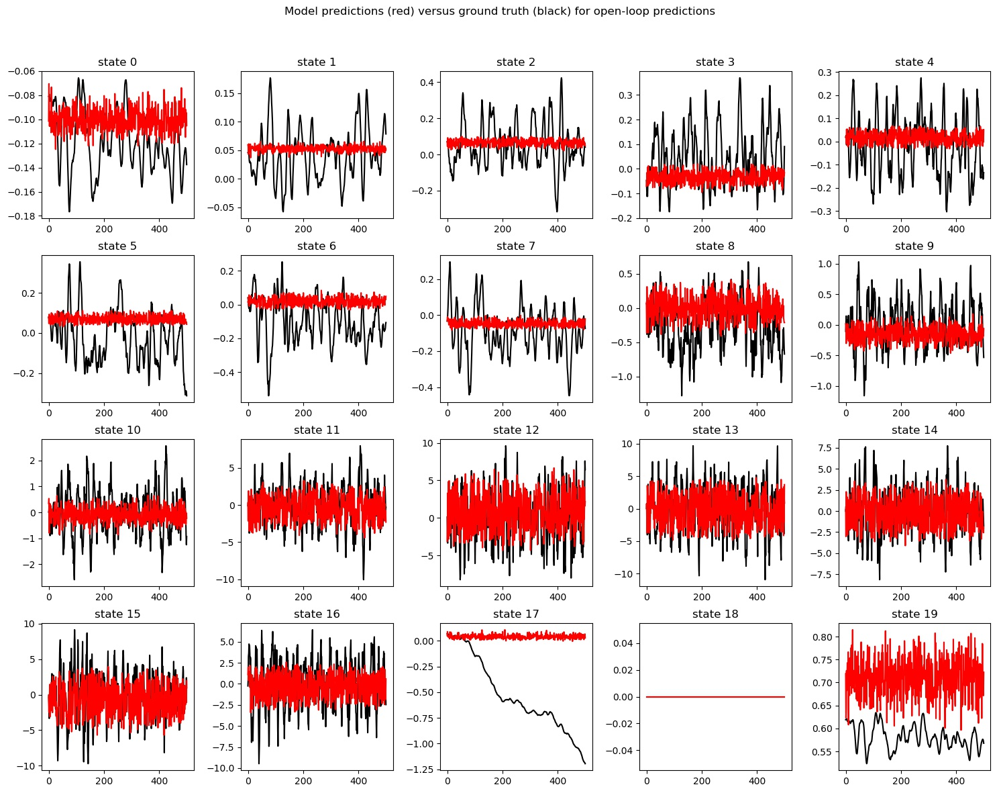
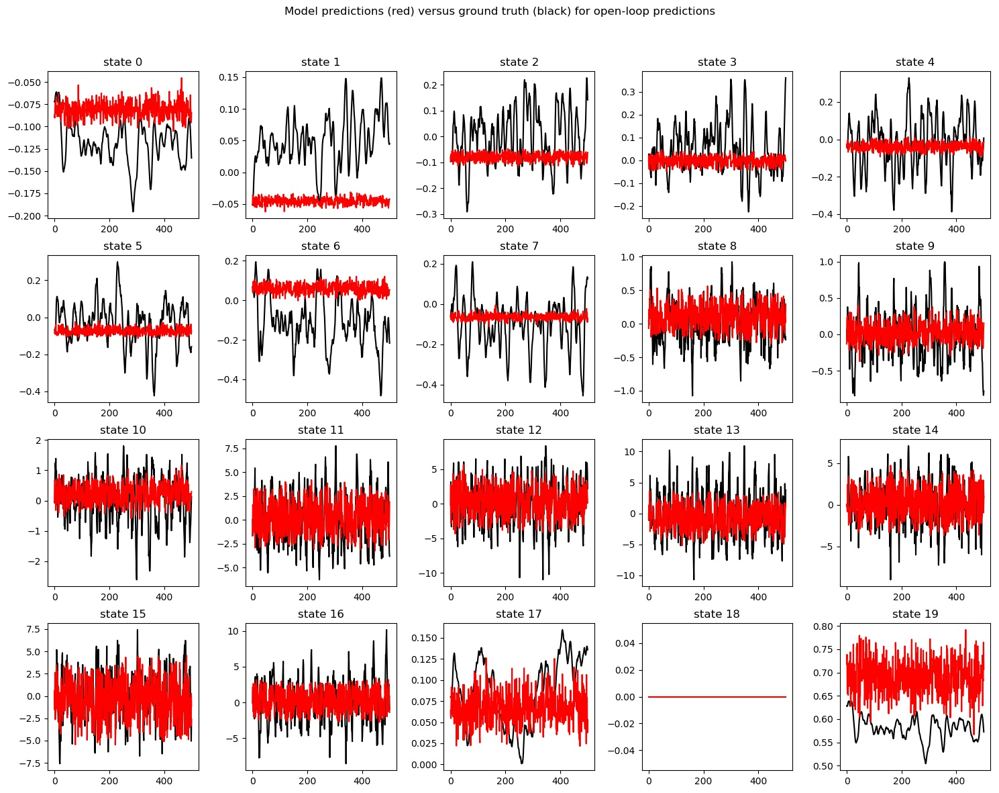
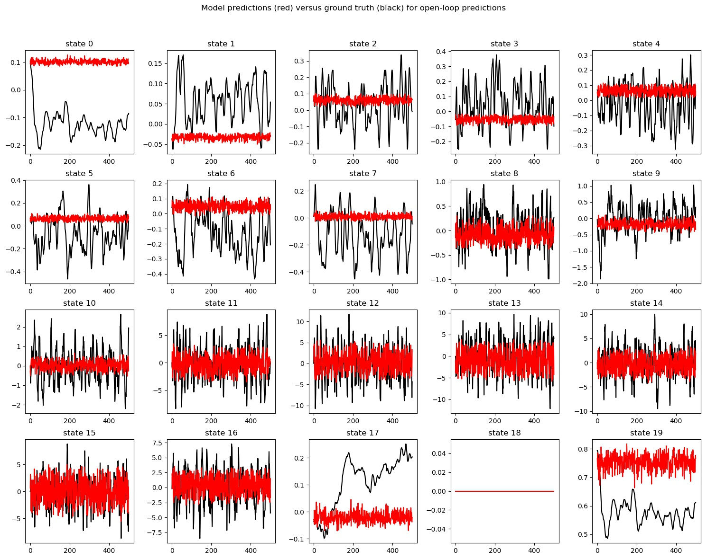
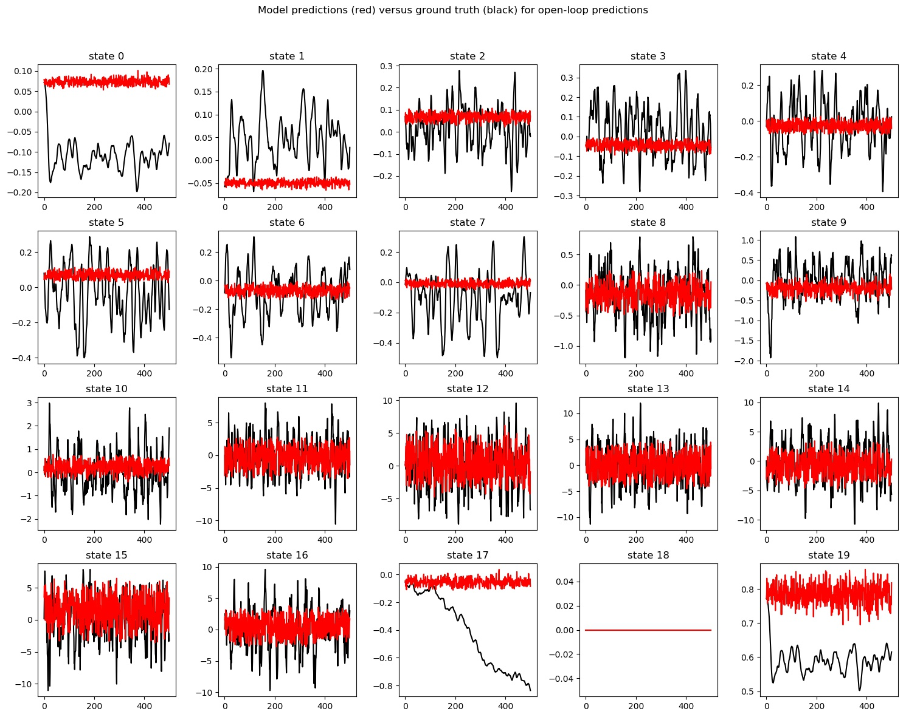
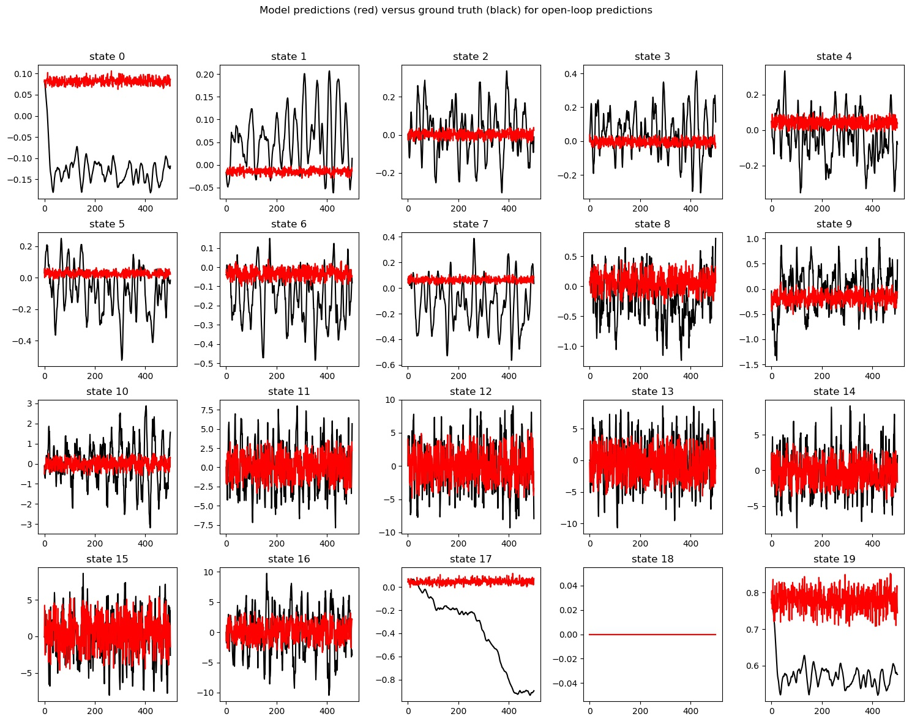
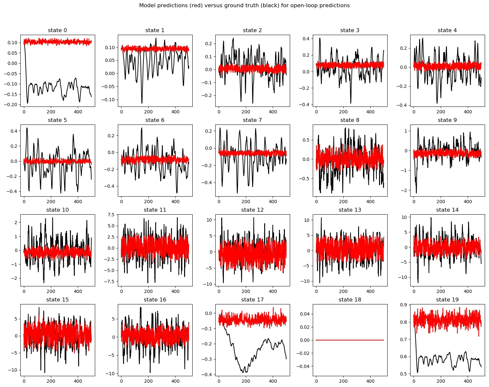
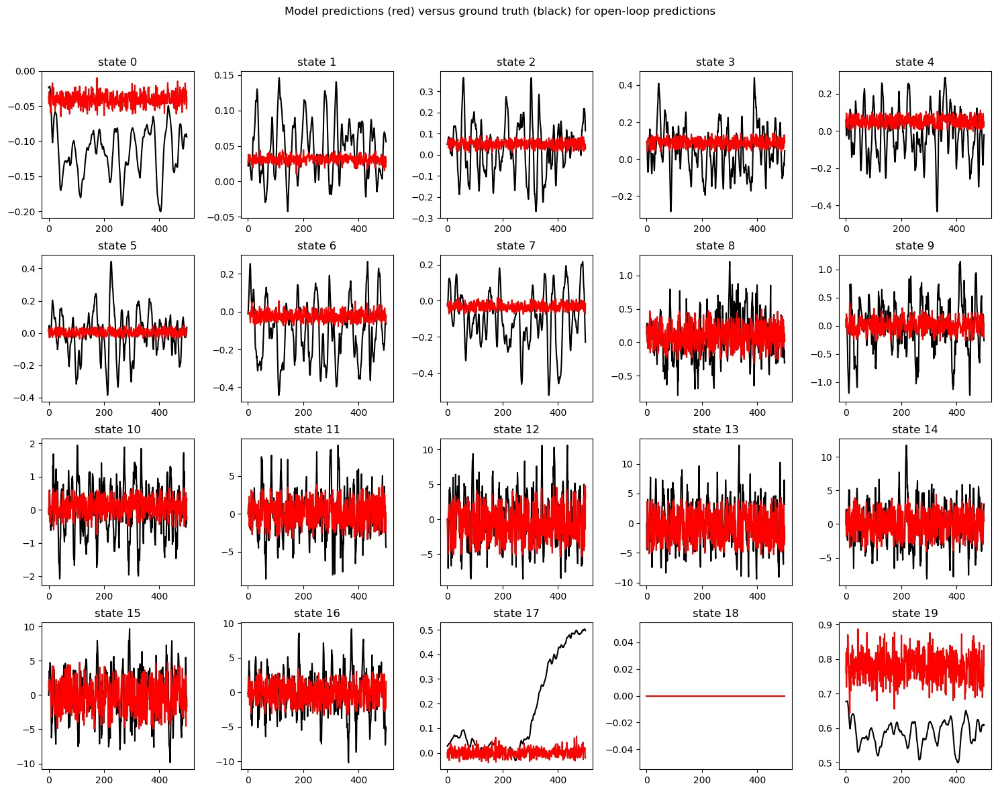
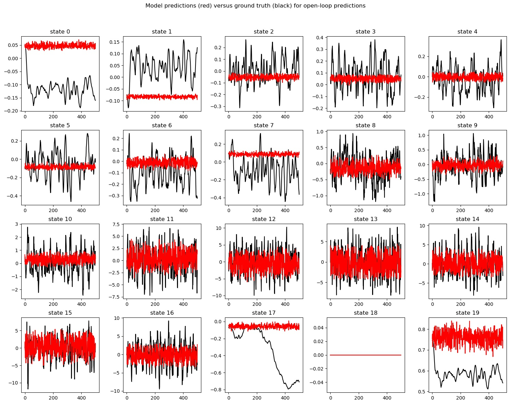

# CS294-112 HW 4: Model-Base RL

## 1. Goal
* Experiement based on paper [Neural Network Dynamics for Model-Based Deep Reinforcement Learning with Model-Free Fine-Tuning](https://arxiv.org/pdf/1708.02596.pdf)
* Reference code on https://sites.google.com/view/mbmf 
  Status: Not yet finished

## 2. Implementation

### 2.1 Problem 1
```bash
python main.py q1
```

* Result of q1 comparsion: model's predictions is similiar to the ground-truth for the majority of the state dimensions











### 2.2 Problem 2
**Comments:**  Not very stable for ReturnAvg [-237.447 ~ -13.6431], somehow could be understood.
```bash
python main.py q2 --training_epochs 120
```
* **result** in HalfCheetah_q2_26-11-2018_13-49-22  
```bash
11-26 13:49:26 HalfCheetah_q2_26-11-2018_13-49-22 INFO     Random policy
11-26 13:49:26 HalfCheetah_q2_26-11-2018_13-49-22 INFO     ---------  ---------
11-26 13:49:26 HalfCheetah_q2_26-11-2018_13-49-22 INFO     ReturnAvg  -144.238
11-26 13:49:26 HalfCheetah_q2_26-11-2018_13-49-22 INFO     ReturnMax   -67.3484
11-26 13:49:26 HalfCheetah_q2_26-11-2018_13-49-22 INFO     ReturnMin  -189.675
11-26 13:49:26 HalfCheetah_q2_26-11-2018_13-49-22 INFO     ReturnStd    32.4637
11-26 13:49:26 HalfCheetah_q2_26-11-2018_13-49-22 INFO     ---------  ---------
11-26 13:49:26 HalfCheetah_q2_26-11-2018_13-49-22 DEBUG    
11-26 13:49:26 HalfCheetah_q2_26-11-2018_13-49-22 DEBUG    : total      0.0 (100.0%)
11-26 13:49:26 HalfCheetah_q2_26-11-2018_13-49-22 DEBUG    : other      0.0 (100.0%)
11-26 13:49:26 HalfCheetah_q2_26-11-2018_13-49-22 DEBUG    
11-26 13:49:26 HalfCheetah_q2_26-11-2018_13-49-22 INFO     Training policy....
11-26 13:49:30 HalfCheetah_q2_26-11-2018_13-49-22 INFO     Evaluating policy...
11-26 13:55:33 HalfCheetah_q2_26-11-2018_13-49-22 INFO     Trained policy
11-26 13:55:33 HalfCheetah_q2_26-11-2018_13-49-22 INFO     -----------------  ------------
11-26 13:55:33 HalfCheetah_q2_26-11-2018_13-49-22 INFO     ReturnAvg          -237.447
11-26 13:55:33 HalfCheetah_q2_26-11-2018_13-49-22 INFO     ReturnMax            38.0936
11-26 13:55:33 HalfCheetah_q2_26-11-2018_13-49-22 INFO     ReturnMin          -622.841
11-26 13:55:33 HalfCheetah_q2_26-11-2018_13-49-22 INFO     ReturnStd           197.061
11-26 13:55:33 HalfCheetah_q2_26-11-2018_13-49-22 INFO     TrainingLossFinal     0.0535422
11-26 13:55:33 HalfCheetah_q2_26-11-2018_13-49-22 INFO     TrainingLossStart    15.4598
11-26 13:55:33 HalfCheetah_q2_26-11-2018_13-49-22 INFO     -----------------  ------------
11-26 13:55:33 HalfCheetah_q2_26-11-2018_13-49-22 DEBUG    
11-26 13:55:33 HalfCheetah_q2_26-11-2018_13-49-22 DEBUG    : total      367.0 (100.0%)
11-26 13:55:33 HalfCheetah_q2_26-11-2018_13-49-22 DEBUG    : get action 362.7 (98.8%)
11-26 13:55:33 HalfCheetah_q2_26-11-2018_13-49-22 DEBUG    : train policy 3.6 (1.0%)
11-26 13:55:33 HalfCheetah_q2_26-11-2018_13-49-22 DEBUG    : env step   0.5 (0.1%)
11-26 13:55:33 HalfCheetah_q2_26-11-2018_13-49-22 DEBUG    : other      0.1 (0.0%)
11-26 13:55:33 HalfCheetah_q2_26-11-2018_13-49-22 DEBUG  
```

```bash
python main.py q2
```
* **result** in HalfCheetah_q2_26-11-2018_13-59-18   
```bash
11-26 13:59:22 HalfCheetah_q2_26-11-2018_13-59-18 INFO     Random policy
11-26 13:59:22 HalfCheetah_q2_26-11-2018_13-59-18 INFO     ---------  ---------
11-26 13:59:22 HalfCheetah_q2_26-11-2018_13-59-18 INFO     ReturnAvg  -148.156
11-26 13:59:22 HalfCheetah_q2_26-11-2018_13-59-18 INFO     ReturnMax   -64.5675
11-26 13:59:22 HalfCheetah_q2_26-11-2018_13-59-18 INFO     ReturnMin  -236.305
11-26 13:59:22 HalfCheetah_q2_26-11-2018_13-59-18 INFO     ReturnStd    43.454
11-26 13:59:22 HalfCheetah_q2_26-11-2018_13-59-18 INFO     ---------  ---------
11-26 13:59:22 HalfCheetah_q2_26-11-2018_13-59-18 DEBUG    
11-26 13:59:22 HalfCheetah_q2_26-11-2018_13-59-18 DEBUG    : total      0.0 (100.0%)
11-26 13:59:22 HalfCheetah_q2_26-11-2018_13-59-18 DEBUG    : other      0.0 (100.0%)
11-26 13:59:22 HalfCheetah_q2_26-11-2018_13-59-18 DEBUG    
11-26 13:59:22 HalfCheetah_q2_26-11-2018_13-59-18 INFO     Training policy....
11-26 13:59:24 HalfCheetah_q2_26-11-2018_13-59-18 INFO     Evaluating policy...
11-26 14:05:48 HalfCheetah_q2_26-11-2018_13-59-18 INFO     Trained policy
11-26 14:05:48 HalfCheetah_q2_26-11-2018_13-59-18 INFO     -----------------  -----------
11-26 14:05:48 HalfCheetah_q2_26-11-2018_13-59-18 INFO     ReturnAvg           -13.6431
11-26 14:05:48 HalfCheetah_q2_26-11-2018_13-59-18 INFO     ReturnMax           197.711
11-26 14:05:48 HalfCheetah_q2_26-11-2018_13-59-18 INFO     ReturnMin          -185.123
11-26 14:05:48 HalfCheetah_q2_26-11-2018_13-59-18 INFO     ReturnStd           122.442
11-26 14:05:48 HalfCheetah_q2_26-11-2018_13-59-18 INFO     TrainingLossFinal     0.115874
11-26 14:05:48 HalfCheetah_q2_26-11-2018_13-59-18 INFO     TrainingLossStart    14.7317
11-26 14:05:48 HalfCheetah_q2_26-11-2018_13-59-18 INFO     -----------------  -----------
11-26 14:05:48 HalfCheetah_q2_26-11-2018_13-59-18 DEBUG    
11-26 14:05:48 HalfCheetah_q2_26-11-2018_13-59-18 DEBUG    : total      385.8 (100.0%)
11-26 14:05:48 HalfCheetah_q2_26-11-2018_13-59-18 DEBUG    : get action 383.3 (99.4%)
11-26 14:05:48 HalfCheetah_q2_26-11-2018_13-59-18 DEBUG    : train policy 1.8 (0.5%)
11-26 14:05:48 HalfCheetah_q2_26-11-2018_13-59-18 DEBUG    : env step   0.5 (0.1%)
11-26 14:05:48 HalfCheetah_q2_26-11-2018_13-59-18 DEBUG    : other      0.1 (0.0%)
11-26 14:05:48 HalfCheetah_q2_26-11-2018_13-59-18 DEBUG
```

### 2.3 Problem 3a
```bash
python main.py q3
```
* **result** in HalfCheetah_q3_26-11-2018_11-56-26   
```bash
11-26 13:03:53 HalfCheetah_q3_26-11-2018_11-56-26 INFO     MLRL On-Policy Generation 10 Iteration: ReturnAvg=0.036562581063363506, ReturnStd=0.6299013504853621
11-26 13:03:53 HalfCheetah_q3_26-11-2018_11-56-26 INFO     Iteration 10
11-26 13:03:53 HalfCheetah_q3_26-11-2018_11-56-26 INFO     Training policy...
11-26 13:04:13 HalfCheetah_q3_26-11-2018_11-56-26 INFO     Gathering rollouts...
11-26 13:10:53 HalfCheetah_q3_26-11-2018_11-56-26 INFO     Appending dataset...
11-26 13:10:53 HalfCheetah_q3_26-11-2018_11-56-26 INFO     -----------------  ------------
11-26 13:10:53 HalfCheetah_q3_26-11-2018_11-56-26 INFO     Itr                 10
11-26 13:10:53 HalfCheetah_q3_26-11-2018_11-56-26 INFO     ReturnAvg          248.767
11-26 13:10:53 HalfCheetah_q3_26-11-2018_11-56-26 INFO     ReturnMax          327.469
11-26 13:10:53 HalfCheetah_q3_26-11-2018_11-56-26 INFO     ReturnMin           97.0671
11-26 13:10:53 HalfCheetah_q3_26-11-2018_11-56-26 INFO     ReturnStd           63.2444
11-26 13:10:53 HalfCheetah_q3_26-11-2018_11-56-26 INFO     TrainingLossFinal    0.00746769
11-26 13:10:53 HalfCheetah_q3_26-11-2018_11-56-26 INFO     TrainingLossStart    0.00623914
11-26 13:10:53 HalfCheetah_q3_26-11-2018_11-56-26 INFO     -----------------  ------------
11-26 13:10:53 HalfCheetah_q3_26-11-2018_11-56-26 DEBUG    
11-26 13:10:53 HalfCheetah_q3_26-11-2018_11-56-26 DEBUG    : total      420.4 (100.0%)
11-26 13:10:53 HalfCheetah_q3_26-11-2018_11-56-26 DEBUG    : get action 399.6 (95.0%)
11-26 13:10:53 HalfCheetah_q3_26-11-2018_11-56-26 DEBUG    : train policy 20.0 (4.8%)
11-26 13:10:53 HalfCheetah_q3_26-11-2018_11-56-26 DEBUG    : env step   0.6 (0.1%)
11-26 13:10:53 HalfCheetah_q3_26-11-2018_11-56-26 DEBUG    : other      0.3 (0.1%)
11-26 13:10:53 HalfCheetah_q3_26-11-2018_11-56-26 DEBUG    
```

### 2.4 Problem 3b (Hyperparameter)

* Random Action Selection
    ```bash
    python main.py q3 --exp_name action128 --num_random_action_selection 128 
    python main.py q3 --exp_name action4096 --num_random_action_selection 4096 
    python main.py q3 --exp_name action16384 --num_random_action_selection 16384 [Not Finished]
    python plot.py --exps HalfCheetah_q3_action128 HalfCheetah_q3_action4096 HalfCheetah_q3_action16384 --save HalfCheetah_q3_actions
    ```
    **Result**:     
    1. "python main.py q3 --exp_name action128 --num_random_action_selection 128" result in HalfCheetah_q3_action128
    2. "python main.py q3 --exp_name action4096 --num_random_action_selection 4096" result in HalfCheetah_q3_action4096
    3. "python main.py q3 --exp_name action16384 --num_random_action_selection 16384" result in HalfCheetah_q3_action16384 [Not Finished]
    4. plot result

* MPC Horizon
    ```bash
    python main.py q3 --exp_name horizon10 --mpc_horizon 10
    python main.py q3 --exp_name horizon15 --mpc_horizon 15
    python main.py q3 --exp_name horizon20 --mpc_horizon 20  [Not Started]
    python plot.py --exps HalfCheetah_q3_horizon10 HalfCheetah_q3_horizon15 HalfCheetah_q3_horizon20 --save HalfCheetah_q3_mpc_horizon
    ```
    **result**:     
    1. "python main.py q3 --exp_name horizon10 --mpc_horizon 10" result in HalfCheetah_q3_horizon10
    2. "python main.py q3 --exp_name horizon15 --mpc_horizon 15" result in HalfCheetah_q3_horizon15
    3. "python main.py q3 --exp_name horizon20 --mpc_horizon 20" result in HalfCheetah_q3_horizon20
    4. plot result

* Neural Network Layer Number
    ```bash
    python main.py q3 --exp_name layers1 --nn_layers 1
    python main.py q3 --exp_name layers2 --nn_layers 2
    python main.py q3 --exp_name layers3 --nn_layers 3
    python plot.py --exps HalfCheetah_q3_layers1 HalfCheetah_q3_layers2 HalfCheetah_q3_layers3 --save HalfCheetah_q3_nn_layers
    ```
    **result**:     
    1. "python main.py q3 --exp_name layers1 --nn_layers 1" result in HalfCheetah_q3_layers1
    2. "python main.py q3 --exp_name layers2 --nn_layers 2" result in HalfCheetah_q3_layers2
    3. "python main.py q3 --exp_name layers3 --nn_layers 3" result in HalfCheetah_q3_layers3
    4. plot result

### 2.5 Extra Credit
#### 2.5.1 Cross Entropy Method (CEM)
About CEM, refer to [wiki defintion of Cross-entropy method](https://en.wikipedia.org/wiki/Cross-entropy_method).


#### 2.5.2 Multi-step Loss

