# CS294-112 HW 5a: Exploration

Dependencies:
 * Python **3.5**
 * Numpy version **1.14.5**
 * TensorFlow version **1.10.5**
 * MuJoCo version **1.50** and mujoco-py **1.50.1.56**
 * seaborn
 * tqdm==**4.26.0**

Before doing anything, first replace `gym/envs/mujoco/half_cheetah.py` with the provided `sparse_half_cheetah.py` file. It is always a good idea to keep a copy of the original `gym/envs/mujoco/half_cheetah.py` just in case you need it for something else.

You will implement `density_model.py`, `exploration.py`, and `train_ac_exploration_f18.py`.

See the hw5a.pdf in this folder for further instructions.
<!--See the [HW5 PDF](http://rail.eecs.berkeley.edu/deeprlcourse/static/homeworks/hw5a.pdf) for further instructions-->

## 1. Preparaion of "sparse_half_cheetah.py" for SparseHalfCheetah-v1
   1) Customize ~/miniconda3/lib/python3.6/site-packages/gym/envs/__init__.py or ~/anaconda3/lib/python3.6/site-packages/gym/envs/__init__.py
   ```python
   ## Orlando's adding for hw5a of CS-Berkeley
   register(
      id='SparseHalfCheetah-v1',
      entry_point='gym.envs.mujoco:SparseHalfCheetahEnv',
      max_episode_steps=1000,
      reward_threshold=4800.0,
   )
   ```
   2) prepare 'SparseHalfCheetah-v1' and assert
   ```bash
   cp hw5/exp/sparse_half_cheetah.py ~/miniconda3/lib/python3.6/site-packages/gym/envs/mujoco/
   or 
   cp sparse_half_cheetah.py ~/anaconda3/lib/python3.6/site-packages/gym/envs/mujoco/
   ```
   ```python
   # customize sparse_half_cheetah.py
   class SparseHalfCheetahEnv(mujoco_env.MujocoEnv, utils.EzPickle):
    def __init__(self):
        mujoco_env.MujocoEnv.__init__(self, 'sparse_half_cheetah.xml', 5)
        utils.EzPickle.__init__(self)
   ```
   ```bash
   cp assets/half_cheetah.xml assets/sparse_half_cheetah.xml
   ```
   ```python
   # customize ~/miniconda3/lib/python3.6/site-packages/gym/envs/mujoco/__init__.py or ~/anaconda3/lib/python3.6/site-packages/gym/envs/mujoco/__init__.py
    from gym.envs.mujoco.mujoco_env import MujocoEnv
    # ^^^^^ so that user gets the correct error
    # message if mujoco is not installed correctly
    ...
    from gym.envs.mujoco.sparse_half_cheetah import SparseHalfCheetahEnv
    ...
   ```
   2) test if environment "SparseHalfCheetah-v1" is ready
   ```python
   import gym 
   env = gym.make("SparseHalfCheetah-v1") 
   ```
   3) check for "PointMass-v0"
   ```bash
   python pointmass.py test_pointmass
   ```


## 2. Implementation
### 2.1 Problem 1
* Run program
```bash
python train_ac_exploration_f18.py PointMass-v0 -n 100 -b 1000 -e 3 --density_model none -s 8 --exp_name PM_bc0_s8
# result folder: data/ac_PM_bc0_s8_PointMass-v0_04-12-2018_23-24-03
python train_ac_exploration_f18.py PointMass-v0 -n 100 -b 1000 -e 3 --density_model hist -bc 0.01 -s 8 --exp_name PM_hist_bc0.01_s8
# result folder: data/ac_PM_hist_bc0.01_s8_PointMass-v0_04-12-2018_23-27-47
```
* Plot result
```bash
python plot.py data/ac_PM_bc0_s8_PointMass-v0_04-12-2018_23-24-03 data/ac_PM_hist_bc0.01_s8_PointMass-v0_04-12-2018_23-27-47 --legend noexp_PointMass hist_PointMass --value AverageReturn StdReturn EpLenMean
```
1. AverageReturn Figure:  

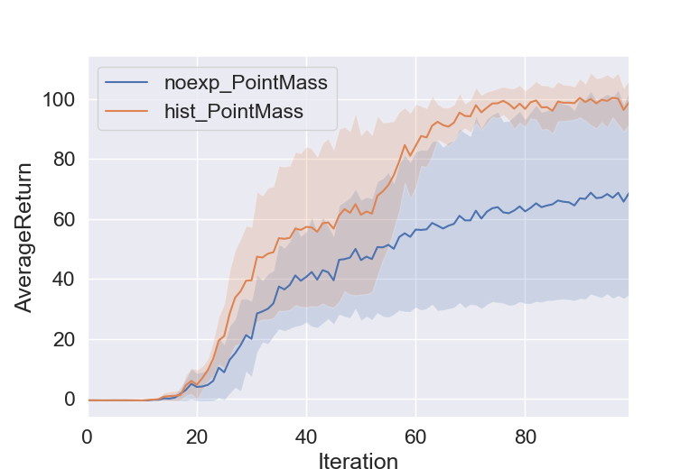

2. StdReturn Mean:   

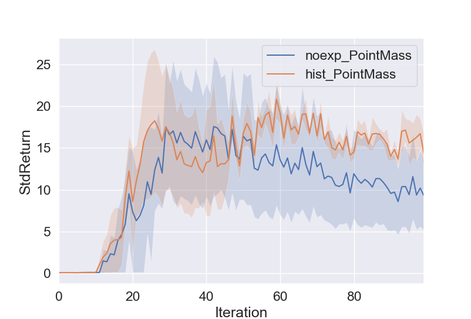

3. EpLenMean Mean:   

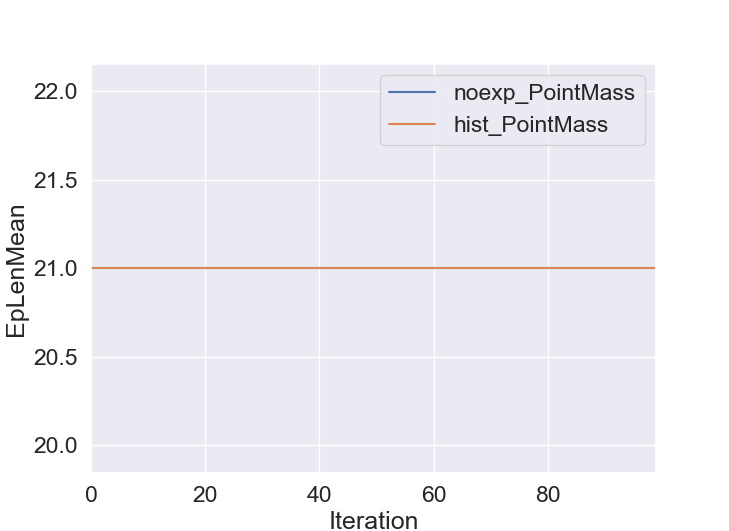

### 2.2 Problem 2
* Run program
```bash
python train_ac_exploration_f18.py PointMass-v0 -n 100 -b 1000 -e 3 --density_model rbf -bc 0.01 -s 8 -sig 0.2 --exp_name PM_rbf_bc0.01_s8_sig0.2
# result folder: data/ac_PM_rbf_bc0.01_s8_sig0.2_PointMass-v0_05-12-2018_11-33-36
```
* Plot result
```bash
python plot.py data/ac_PM_bc0_s8_PointMass-v0_04-12-2018_23-24-03 data/ac_PM_rbf_bc0.01_s8_sig0.2_PointMass-v0_05-12-2018_11-33-36 --legend noexp_PointMass rbf_PointMass --value AverageReturn StdReturn EpLenMean
```
1. AverageReturn Figure:  

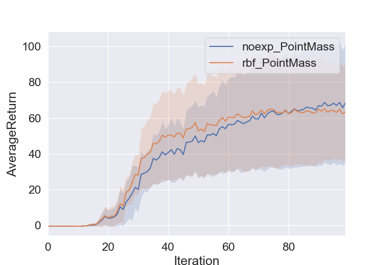

2. StdReturn Mean:   

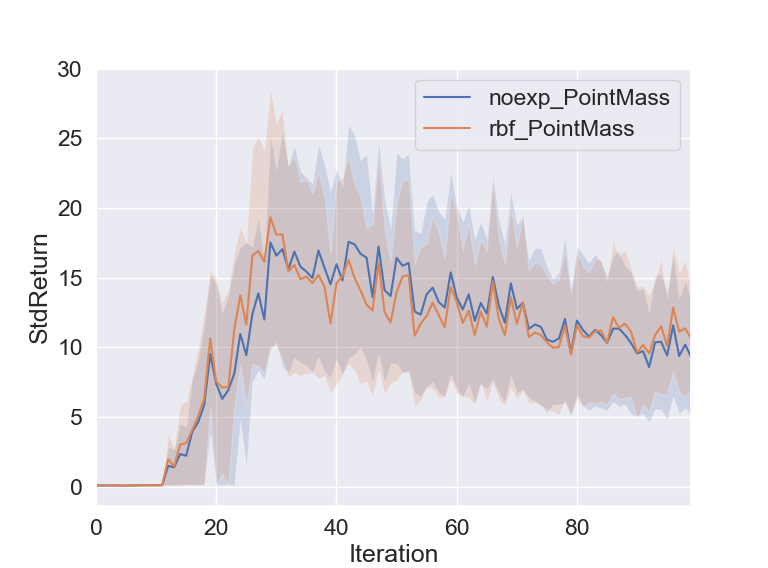

3. EpLenMean Mean:   

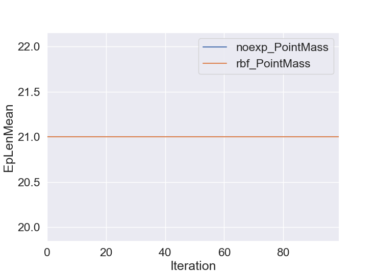

### 2.3 Problem 3 - The EX2 discriminator
* Run program
```bash
python train_ac_exploration_f18.py PointMass-v0 -n 100 -b 1000 -e 3 --density_model ex2 -s 8 -bc 0.05 -kl 0.1 -dlr 0.001 -dh 8 -dti 1000 --exp_name PM_ex2_s8_bc0.05_kl0.1_dlr0.001_dh8_dti1000
# result folder: data/ac_PM_ex2_s8_bc0.05_kl0.1_dlr0.001_dh8_dti1000_PointMass-v0_07-12-2018_17-13-11
```
* Plot result [noexp_PointMass not uploaded]
```bash
python plot.py data/ac_PM_bc0_s8_PointMass-v0_04-12-2018_23-24-03 data/ac_PM_ex2_s8_bc0.05_kl0.1_dlr0.001_dh8_dti1000_PointMass-v0_07-12-2018_17-13-11 --legend noexp_PointMass ex2_PointMass --value AverageReturn StdReturn EpLenMean
```
1. AverageReturn Figure:  

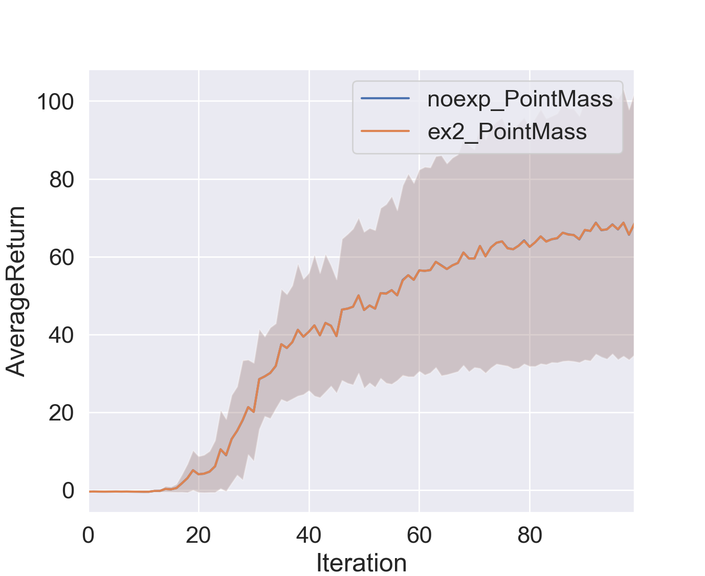

2. StdReturn Mean:   

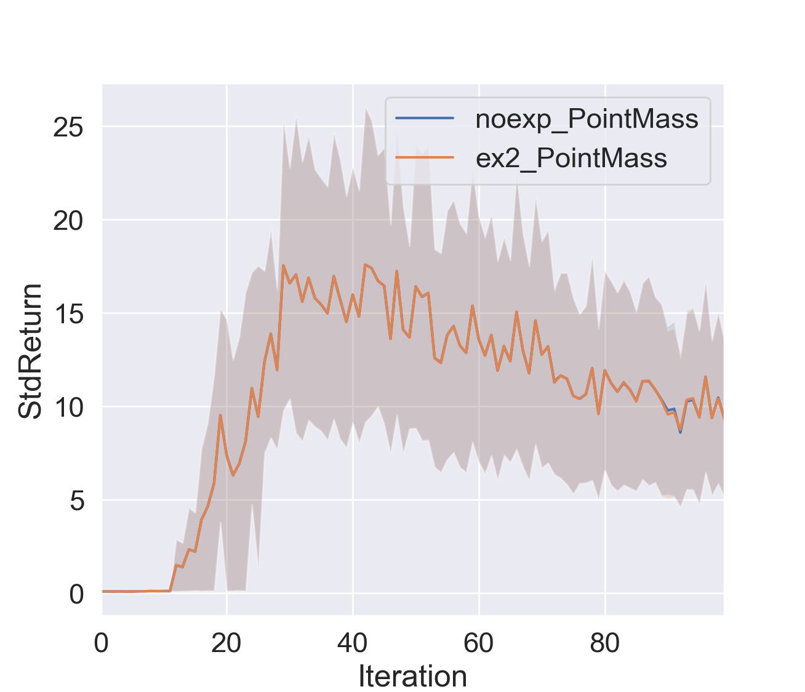

3. EpLenMean Mean:   

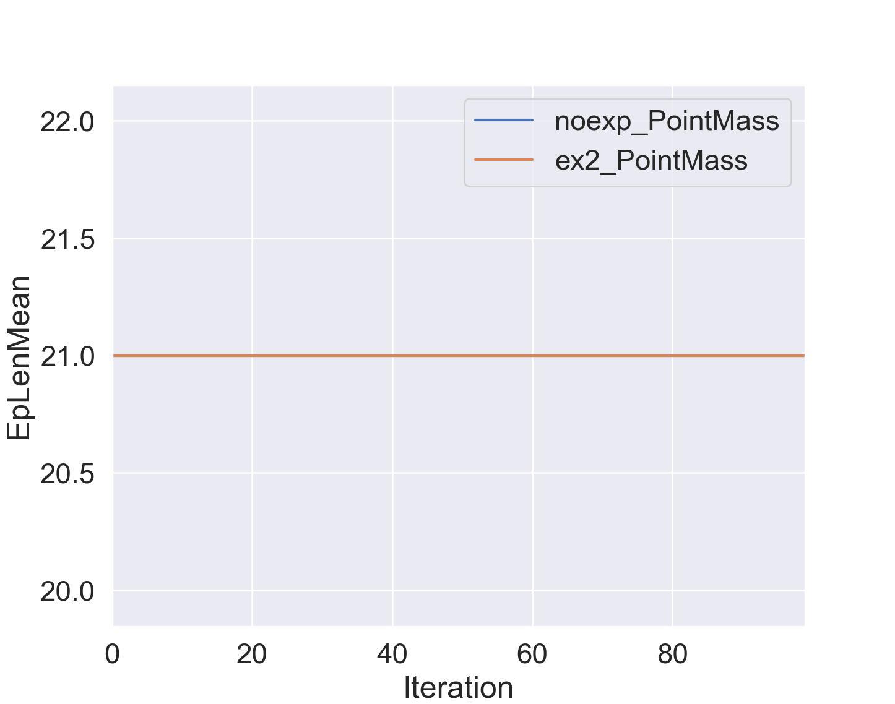

### 2.4 Problem 4
* Run program
```bash
python train_ac_exploration_f18.py SparseHalfCheetah-v1 -ep 150 --discount 0.9 -n 100 -e 3 -l 2 -s 32 -b 30000 -lr 0.02 --density_model none --exp_name HC_bc0
# result folder: data/ac_HC_bc0_SparseHalfCheetah-v1_07-12-2018_17-37-01
python train_ac_exploration_f18.py SparseHalfCheetah-v1 -ep 150 --discount 0.9 -n 100 -e 3 -l 2 -s 32 -b 30000 -lr 0.02 --density_model ex2 -bc 0.001 -kl 0.1 -dlr 0.005 -dti 1000 --exp_name HC_bc0.001_kl0.1_dlr0.005_dti1000
# result folder: 
python train_ac_exploration_f18.py SparseHalfCheetah-v1 -ep 150 --discount 0.9 -n 100 -e 3 -l 2 -s 32 -b 30000 -lr 0.02 --density_model ex2 -bc 0.0001 -kl 0.1 -dlr 0.005 -dti 10000 --exp_name HC_bc0.0001_kl0.1_dlr0.005_dti10000
# result folder: 
```
* Plot result
```bash
python plot.py  --legend --value AverageReturn StdReturn EpLenMean
```
1. AverageReturn Figure:  

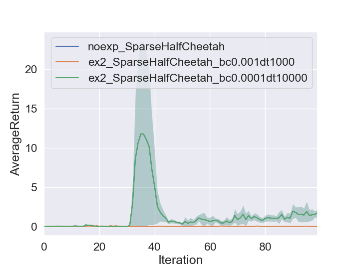

2. StdReturn Mean:   

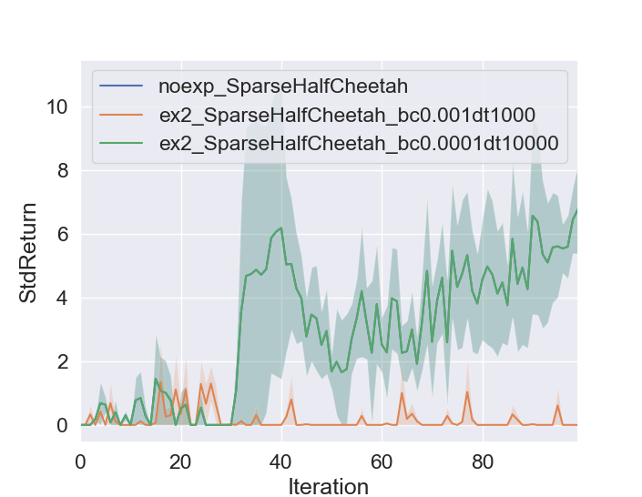

3. EpLenMean Mean:   

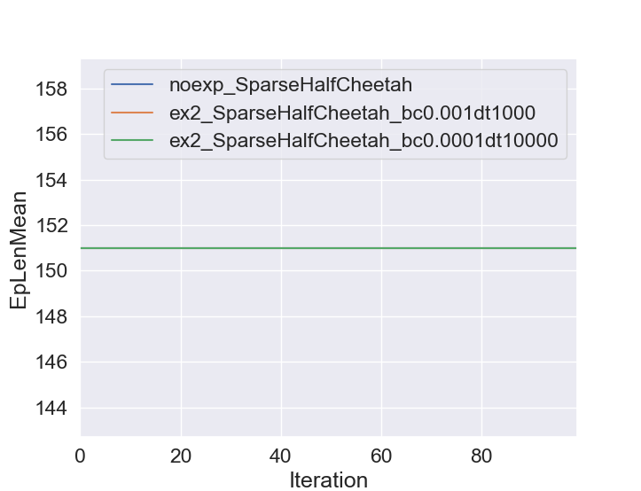