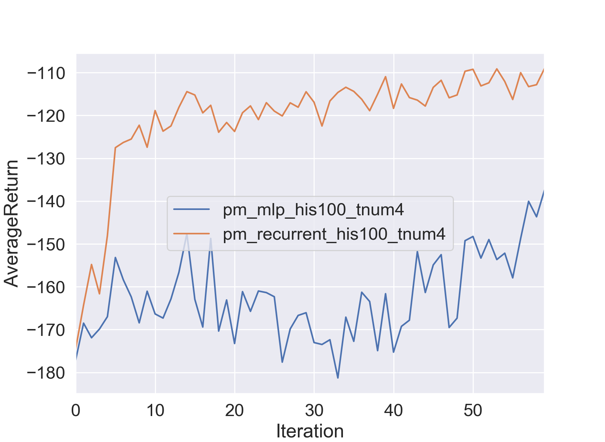
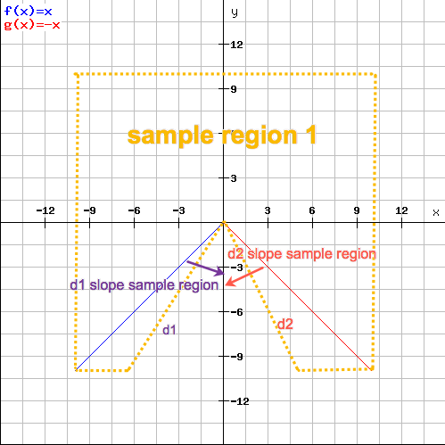

# CS294-112 HW 5c: Meta-Learning

Dependencies:
 * Python **3.5**
 * Numpy version 1.14.5
 * TensorFlow version 1.10.5
 * MuJoCo version **1.50** and mujoco-py **1.50.1.56**
 * OpenAI Gym version **0.10.5**
 * seaborn
 * Box2D==2.3.2

See the [HW5c PDF](http://rail.eecs.berkeley.edu/deeprlcourse/static/homeworks/hw5c.pdf) for further instructions.

## 1. Implementation
### Problem 1: Context as Task ID
In point_mass_observed.py, state is fixed. In order to **augment the observation with a one-hot vector encoding the task ID**, do as follow:
* Change the dimension of the observation space, Line 29
```python
# Line 29
self.observation_space = spaces.Box(low=-np.inf, high=np.inf, shape=(2+self._num_tasks,))
```
* Augment the observation with a one-hot vector that encodes the task ID, Line 61 and Line 33
```python
## Line 33
def onehot(num_task, task_id):
    """[using num_tasks and task_id to generate onehot vector for task identifier]
    
    Arguments:
        num_task {[int]} -- [number of task]
        task_id {[int]} -- [task identifier]
    """
    onehot_vector = np.zeros(num_task)
    onehot_vector[task_id] = 1
    return onehot_vector

idx = np.random.choice(len(self.tasks))
# task id from target scope
self._task = self.tasks[idx]
self._task_onehot = onehot(self._num_tasks, self._task)

## Line 61
return np.concatenate(np.copy(self._state), self._task_onehot)
```

### Problem 2: Meta-Learned Context

### Problem 3: Generalization

## 2. Deliverables
### 2.1 Problem 1 
```bash
# training with only Multilayer Perceptron for predicting result
python train_policy.py 'pm-obs' --exp_name pm_obs_average_return --history 1 -lr 5e-5 -n 100 --num_tasks 4
# result in data/pm_obs_average_return_pm-obs_17-12-2018_21-37-03
```
* Debugging for issue of average reward not -50
```bash
# need to use debugger port not so big, 8000 will be OK
tensorboard --logdir /tmp/logdir --host localhost --port 50000 --debugger_port 8000
python train_policy.py 'pm-obs' --exp_name pm_obs_average_return --history 1 -lr 5e-5 -n 100 --num_tasks 4 -debug True
```
* Result analysis
```bash
python plot.py data/pm_obs_average_return_pm-obs_17-12-2018_21-37-03 --legend pm-obs --value AverageReturn FinalReward StdReturn
```
1. AverageReturn Figure:  


2. FinalReward Mean:   


3. StdReturn Mean:   


### 2.2 Problem 2

* For 4 threading processing
```bash
## 1. feed-forward neural network - only Iteration 59
python train_policy.py 'pm' --exp_name pm_mlp_history100_tnum4 --history 100 --discount 0.90 -lr 5e-4 -n 60 -tnum 4
# result in data/pm_mlp_history100_tnum4_pm_18-12-2018_14-42-13

## 2. recurrent neural network
python train_policy.py 'pm' --exp_name pm_recurrent_history100_tnum4 --history 100 --discount 0.90 -lr 5e-4 -n 60  -tnum 4 -rec
# result in data/pm_recurrent_history100_tnum4_pm_18-12-2018_15-25-31
```

* For 3 threading processing
```bash
## 1. feed-forward neural network - only Iteration 59
python train_policy.py 'pm' --exp_name pm_mlp_history100_tnum3 --history 100 --discount 0.90 -lr 5e-4 -n 60 -tnum 3
# result in data/pm_mlp_history100_tnum3_pm_18-12-2018_14-56-53

## 2. recurrent neural network
python train_policy.py 'pm' --exp_name pm_recurrent_history100_tnum3 --history 100 --discount 0.90 -lr 5e-4 -n 60  -tnum 3 -rec
# result in 
```

* For 2 threading processing
```bash
## 1. feed-forward neural network - only Iteration 59
python train_policy.py 'pm' --exp_name pm_mlp_history100_tnum2 --history 100 --discount 0.90 -lr 5e-4 -n 60 -tnum 2
# result in data/pm_mlp_history100_tnum2_pm_18-12-2018_15-07-02

## 2. recurrent neural network
python train_policy.py 'pm' --exp_name pm_recurrent_history100_tnum2 --history 100 --discount 0.90 -lr 5e-4 -n 60  -tnum 2 -rec
# result in 
```

* For single thread process [Too slow, then use multithread to speed-up]
```bash
## 1. feed-forward neural network
python train_policy.py 'pm' --exp_name pm_mlp_history100 --history 100 --discount 0.90 -lr 5e-4 -n 60
# result in data/pm_mlp_history100_pm_18-12-2018_13-05-16 or data/pm_mlp_history100_pm_18-12-2018_15-15-14 (Only Iteration 59)

## 2. recurrent neural network [Too slow, just skip then run when back to home]
python train_policy.py 'pm' --exp_name pm_recurrent_history100 --history 100 --discount 0.90 -lr 5e-4 -n 60 -rec
# result in 
```

* Result analysis
```bash
# 4 threading of parallelization
python plot.py data/pm_mlp_history100_tnum4_pm_18-12-2018_14-42-13 data/pm_recurrent_history100_tnum4_pm_18-12-2018_15-25-31 --legend pm_mlp_his100_tnum4 pm_recurrent_his100_tnum4 --value AverageReturn FinalReward StdReturn MaxReturn
```
1. AverageReturn Figure:  



2. FinalReward Mean:   


3. StdReturn Mean:   


4. MaxReturn Mean:   


### 2.3 Problem 3
* Training/Testing disjoint region distribution (With Skew to training/testing region)



generated graph from https://rechneronline.de/function-graphs/

1. split region via d1 and d2 slope, d1 is between $[1, \infty]$, d2 is between $[-\infty, -1]$

$$ d1 = uniform(1, \infty) $$
$$ d2 = uniform(-\infty, -1) $$

2. with d1 and d2, we can define region 1 and region 2 as follow:  

$$ region1 = \{ (x, y)| \forall x, -10 \geq y < \max(0, d1 \cdot x, d2 \cdot x ) \}$$
$$ region2 = \{ (x, y)| (x \leq 0 \land d1 \cdot x \leq y \leq 10) \lor (x > 0 \land d2 \cdot x \leq y \leq 10) \}$$

3. Easy to know region1 is much larger than region 2. I define skew case as follow:

    -  When goal (x, y) is sampled in region1 for training case, it's skewed to training (means testing region is much smaller than training => should have better generalization, as RL see more case) 

    -  When goal (x, y) is sampled in region2(lower region down to region1) for training case, it's skewed to training (means testing region is much smaller than training => should have less generalization, as RL see less case) 

* For 4 threading processing with training/testing distribution shift
```bash
# to run together in a batch
python train_policy.py 'pm' --exp_name pm_recurrent_history100_tnum4_ttshift_sktotrain --history 100 --discount 0.90 -lr 5e-4 -n 60  -tnum 4 -rec -ttshift -sktotrain && python train_policy.py 'pm' --exp_name pm_recurrent_history150_tnum4_ttshift --history 150 --discount 0.90 -lr 5e-4 -n 60  -tnum 4 -rec -ttshift && python train_policy.py 'pm' --exp_name pm_recurrent_history150_tnum4_ttshift_sktotrain --history 150 --discount 0.90 -lr 5e-4 -n 60  -tnum 4 -rec -ttshift -sktotrain
```

```bash
## 1. recurrent neural network with history 100 
## skew to testing
python train_policy.py 'pm' --exp_name pm_recurrent_history100_tnum4_ttshift --history 100 --discount 0.90 -lr 5e-4 -n 60  -tnum 4 -rec -ttshift
# result in data/pm_recurrent_history100_tnum4_ttshift_pm_18-12-2018_23-44-46 [2018-12-18 23:04:58.116510 to 2018-12-19 06:30:04.704662]

## skew to training
python train_policy.py 'pm' --exp_name pm_recurrent_history100_tnum4_ttshift_sktotrain --history 100 --discount 0.90 -lr 5e-4 -n 60  -tnum 4 -rec -ttshift -sktotrain
# result in data/pm_recurrent_history100_tnum4_ttshift_sktotrain_pm_19-12-2018_10-06-16

## 2. recurrent neural network with history 150
## skew to testing
python train_policy.py 'pm' --exp_name pm_recurrent_history150_tnum4_ttshift --history 150 --discount 0.90 -lr 5e-4 -n 60  -tnum 4 -rec -ttshift
# result in 

## skew to training [on AWS instance]
python train_policy.py 'pm' --exp_name pm_recurrent_history150_tnum4_ttshift_sktotrain --history 150 --discount 0.90 -lr 5e-4 -n 60  -tnum 4 -rec -ttshift -sktotrain
# result in 
```

* Result analysis for 4 thread with history100
```bash
# 4 threading of parallelization 
python plot.py data/pm_recurrent_history100_tnum4_ttshift_pm_18-12-2018_23-44-46 data/pm_recurrent_history100_tnum4_ttshift_sktotrain_pm_19-12-2018_10-06-16 --legend pm_recurrent_history100_tnum4_ttshift pm_recurrent_history100_tnum4_ttshift_sktotrain --value AverageReturn FinalReward ValAverageReturn ValFinalReward
```
1. AverageReturn Figure:  


2. FinalReward Mean:   


3. ValAverageReturn Mean:   


4. ValFinalReward Mean:   


* Result analysis for 4 thread with history150
```bash
# 4 threading of parallelization 
python plot.py  --legend pm_recurrent_history150_tnum4_ttshift pm_recurrent_history150_tnum4_ttshift_sktotrain --value AverageReturn FinalReward ValAverageReturn ValFinalReward
```
1. AverageReturn Figure:  


2. FinalReward Mean:   


3. ValAverageReturn Mean:   


4. ValFinalReward Mean:   

